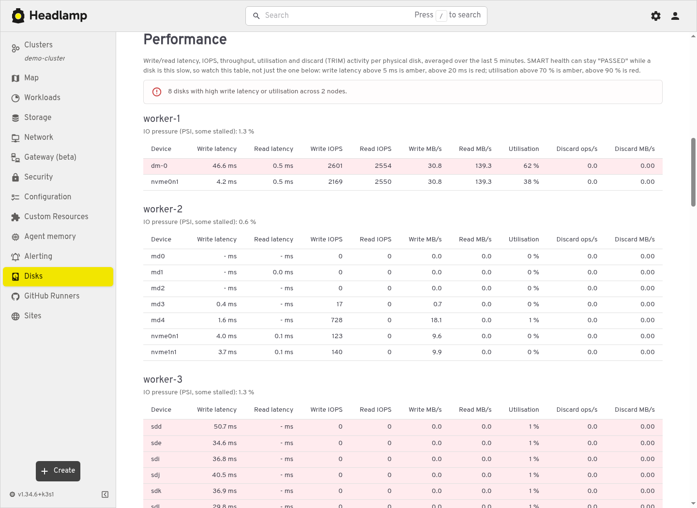
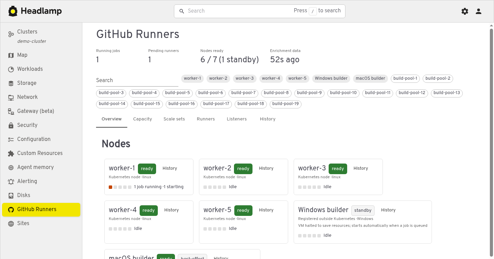
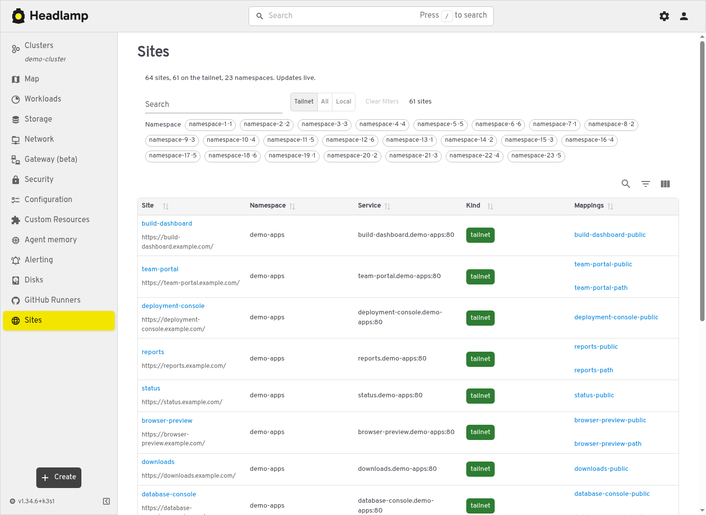
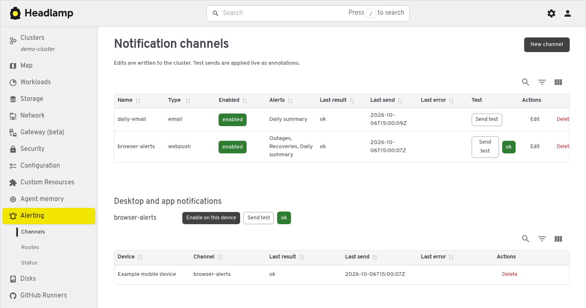
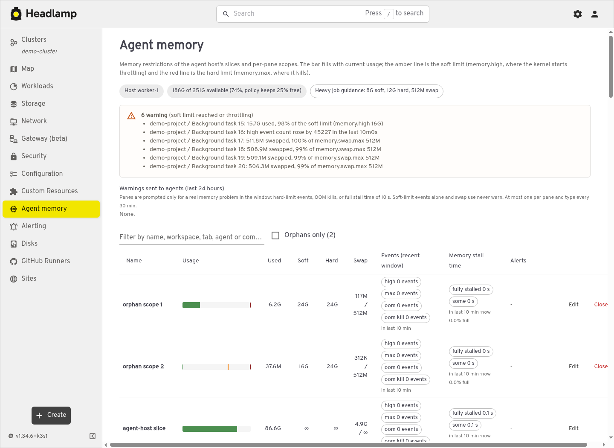

# headlamp-plugins

Five plugins that bring everyday cluster operations into [Headlamp](https://headlamp.dev/):
spot slow disks, see where CI jobs are running, find application URLs, manage
notifications, and understand agent memory pressure.

Built with `@kinvolk/headlamp-plugin` (TypeScript + React). Install the plugins
you need; each has its own release archive and configuration.

| Plugin | Use it to… | Setup guide |
| --- | --- | --- |
| [Disk health](#disk-health) | Compare SMART health, free space and disk performance across nodes | [Configuration and metrics](plugins/disk-health/README.md) |
| [GitHub Runners](#github-runners) | See runner capacity, active jobs and ARC resources together | [Resources and optional enrichment](plugins/github-runners/README.md) |
| [Sites](#sites) | Find an application's URL and the Mappings behind it | [Hostname suffixes and access](plugins/sites/README.md) |
| [Alerting](#alerting) | Configure notification channels, routes and test delivery | [CRDs, web push and GitOps](plugins/alerting/README.md) |
| [Agent memory](#agent-memory) | Inspect memory limits, swap, pressure and recent kernel events | [Backend and permissions](plugins/agent-memory/README.md) |

## A tour of the plugins

These are screenshots of the running plugins, with names and identifying
content replaced in the browser before capture. They show real layouts and
status indicators with illustrative identities. Click an image to view it at
full size.

### Disk health

A disk can pass SMART checks and still be the reason a workload feels slow.
The **Disks** page brings capacity, SMART health and performance into one place;
node details and the Nodes list also expose disk health.



**Example:** a workload is taking longer on `worker-1`. Open **Disks →
Performance**, compare its write latency and utilisation with the other nodes,
then check capacity and SMART counters. The screenshot shows how elevated
latency stands out alongside throughput and I/O pressure, rather than being
hidden behind a healthy SMART result.

Performance values use five-minute rates. The plugin needs a
Prometheus-compatible query endpoint and the relevant disk metrics; the
[setup guide](plugins/disk-health/README.md) lists the queries and settings.

### GitHub Runners

Follow a job from available capacity to its runner, scale set and Kubernetes
pod. **Overview**, **Capacity**, **Scale sets**, **Runners**, **Listeners** and
**History** provide different views of the same runner fleet.



**Example:** a workflow is queued. Check pending runners and node readiness,
filter to its pool, then open the scale set and listener views to see whether
ARC is provisioning a runner. The overview also distinguishes Kubernetes nodes
from registered external builders, including standby and best-effort capacity
when that information is supplied.

The core dashboard watches ARC and Kubernetes resources. Optional backend
enrichment adds job details and history; the browser does not need a GitHub
token or make GitHub API calls. See the
[resource and enrichment guide](plugins/github-runners/README.md).

### Sites

Turn Emissary `Mapping` resources into a searchable application directory.
Mappings for paths and host aliases are grouped into one site, with links to
the application and the resources that route to it.



**Example:** someone asks where the team portal is deployed. Search for
`team-portal`, narrow the namespace, open the site, or follow its Mapping links
to inspect the backing service. Multiple paths and aliases stay together
instead of appearing as unrelated applications.

Needs read access to `mappings.getambassador.io`. Configure the hostname
suffixes to match your deployment; the default view selects tailnet sites.
See the [Sites guide](plugins/sites/README.md).

### Alerting

Manage **Channels**, **Routes** and **Status** from Headlamp. Channels support
email, ntfy, Pushover, webhooks and web push; routes select which notifications
go to which channels.



**Example:** send daily summaries to email and outages to browser
notifications. Choose the alert kinds on each channel, configure the route,
then use **Send test** and inspect the last result. Web push subscriptions
appear below the channels so you can see which devices receive notifications.

A simple route to an existing `browser-alerts` channel looks like this:

```yaml
apiVersion: alerting.example.com/v1alpha1
kind: AlertRoute
metadata:
  name: web-alerts
  namespace: monitoring
spec:
  channels: [browser-alerts]
  match:
    targets: [web]
    kinds: [urgent, recovery]
```

Needs the alerting CRDs and a backend that processes them and delivers
notifications. UI saves change the cluster live. **Copy YAML** and **Download
YAML** let you carry configuration into Git yourself; for resources already
managed by GitOps, follow the [field ownership guidance](plugins/alerting/README.md#git-and-the-ui).
Secret references are shown by name and key, without displaying their values.

### Agent memory

See systemd slices and per-pane scopes alongside their soft and hard memory
limits. Usage bars, swap, recent kernel events and pressure stall information
help explain whether a task is merely using memory or being throttled.



**Example:** an agent task slows down during a build. Filter by workspace or
command and compare usage with `memory.high` and `memory.max`. Check recent
`high`, `max`, `oom` and `oom kill` events together with stall time. The amber
marker is the soft limit; the red marker is the hard limit. An orphan filter
helps find scopes that no longer belong to an active pane.

With write access, **Edit** changes limits and **Close** terminates a scope,
with confirmation. This plugin requires the separate agent-memory backend;
it does not derive host cgroup data from Kubernetes metrics. See the
[backend setup and access guide](plugins/agent-memory/README.md).

Each plugin is distributed as a versioned GitHub Release archive containing
the built `main.js`, its `package.json`, and any plugin assets. The alerting
archive also includes its service worker.
The release contains five plugin archives and five checksum lines.

## Creating a release

Push a strict semantic-version tag such as `v1.2.3` or `v1.2.3-rc.1` to
create a release. The workflow stages the tag version in each plugin's
`package.json` and `package-lock.json` in its job workspace without committing
those changes, then creates and uploads five plugin archives plus
`SHA256SUMS`. Tags containing a hyphen publish as prereleases.

## Installing a release

Download the archive for the plugin and the matching `SHA256SUMS` file from a
GitHub Release, verify the checksum, and extract the archive into Headlamp's
plugins directory (replace the example version with the release you downloaded):

```bash
sha256sum -c SHA256SUMS --ignore-missing
mkdir -p /path/to/headlamp/plugins
tar -xzf disk-health-0.1.0.tar.gz -C /path/to/headlamp/plugins
```

## Public-repo rules and local checks

This repository is public. It must never contain hostnames, domains, internal
IPs, secrets, tokens, emails, usernames or organisation-internal identities;
use placeholders such as `example.com`. See [AGENTS.md](AGENTS.md).

Enforced by deterministic checks:

- **gitleaks** (pinned rev) on commit, push and in CI.
- **`scripts/check-identifiers.sh`** fails on private IPs, `*.local` /
  `*.internal` names, and emails other than `@example.com` / `noreply`.
- A **private deny-list** (`.identifiers-denylist`, gitignored, or the path in
  `$IDENTIFIERS_DENYLIST`) with one regex per line for real domains and names.
  It is never committed. CI requires its repository secret and fails closed
  when it is unavailable. Fork pull requests cannot read repository secrets,
  so a maintainer must run the private check locally for them; generic checks
  still run in CI.

```bash
pipx install pre-commit     # once
make hooks                  # installs pre-commit and pre-push hooks
make check                  # identifiers + gitleaks over the tree and history
make check-plugins          # tsc, lint, build for each plugin, sequentially
```
